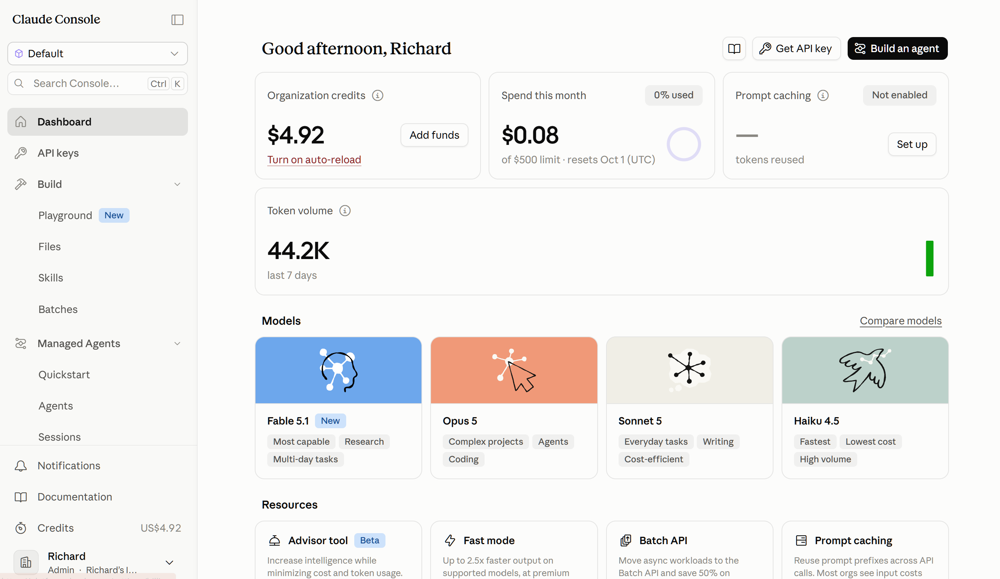

# Reed Jobs ETL & Search

Pipeline that pulls job listings from the Reed API, stores them in MongoDB, backs them up to S3, and supports exact, semantic (including FAISS), and RAG-based search.

## Core requirements

- [x] Extract from an API (Reed)
- [x] Store raw data in MongoDB
- [x] Transform data, store in S3
- [x] Exact/filter search
- [x] Semantic/vector search
- [x] RAG (optional stretch goal)

## Pipeline

```
Reed API → Python → MongoDB → JSON export → S3
```

- `src/extract.py` — searches Reed + fetches full job details (two-stage: search, then per-job details)
- `src/mongo_client.py` — MongoDB connection + CRUD
- `src/export.py` — exports MongoDB → timestamped JSON
- `src/upload_s3.py` — uploads export to S3
- `main.py` — runs the full pipeline end to end

## Search

Two different search types, deliberately using two different data sources:

- `src/filter_search.py` — exact search (location, salary range, contract type, role) — queries **MongoDB** (the live operational store) directly
- `src/semantic_search.py` — meaning-based search, queries MongoDB — original version
- `src/semantic_search_s3.py` — same as above, but loads from the **latest S3 export** instead.
- `src/semantic_search_faiss.py` — same task as `semantic_search_s3.py`, but uses FAISS (a vector search library/index) instead of a manual loop. Not necessary at the current data set size, but included to demonstrate the approach
- `src/rag_search.py` — retrieval (via semantic search) + generation (Claude Haiku) for natural-language Q&A, grounded only in retrieved jobs
- `src/search_app.py` — original terminal interface (exact + semantic search)
- `src/search_app_v2.py` — adds FAISS option, RAG option, a menu loop, and coloured/formatted output

Run: `py -m src.search_app_v2`

**[include video: search_app_v2.py run, showing all 5 menu options?]**


## Setup

- Python 3.x, MongoDB running locally
- `pip install -r requirements.txt`
- Copy `.env.example` → `.env`, fill in:
  - `REED_API_KEY`
  - `MONGO_URI`
  - `AWS_ACCESS_KEY_ID` / `AWS_SECRET_ACCESS_KEY` / `AWS_S3_BUCKET` / `AWS_REGION`
  - `ANTHROPIC_API_KEY` (for RAG)
- Run pipeline: `py main.py`
- Run search: `py -m src.search_app_v2`

[TODO: any setup gotchas to mention?]

## Data

- Source: Reed API (`reed.co.uk/developers`). Free but email required.
- Searches: "data analyst", "data engineer", "BI analyst" — London  - 
- ~267 jobs currently in MongoDB (grew from an initial ~24-30 job test run)
- MongoDB

     
- AWS S3 Bucket

    

- Anthropic account:

    
- **Data cleaning: out of scope, by choice.** The raw Reed data is broadly usable as-is. Real issues exist (see Known limitations below) but were judged not severe enough to justify an extra cleaning step within this project's scope/timeline. Downstream code handles some gaps (e.g. `format_salary()` shows "salary not listed" instead of crashing on `None`), but otherwise no values are corrected or deduplicated.

## Document schema

```
{
  _id, job_id, title, employer: {id, name},
  description, location,
  salary: {min, max, currency, type},
  contract_type, job_type, expiration_date, url,
  search_keyword, search_location, date_scraped
}
```

MondoDB's _id is kept separate to Reed's job_id to to ensure changes to one don't impact the other. 

## Semantic search & RAG details

- Embedding model: `sentence-transformers` (`all-MiniLM-L6-v2`), 384-dim vectors
- Embeds `title + description` combined
- Cosine similarity computed manually (via numpy) in `semantic_search.py`/`semantic_search_s3.py` to help understanding of the process
- `semantic_search_faiss.py` uses FAISS's `IndexFlatIP`. This produces identical results/scores to the manual version on a controlled test (same query string, same rankings and scores to 3 decimal places).
- RAG (`rag_search.py`): retrieves top ~50 jobs via semantic search, builds a prompt instructing the model to answer using ONLY the retrieved postings, calls Claude Haiku (`claude-haiku-4-5-20251001`)
- Cost: RAG testing (many queries) costs under $0.10 total on the Anthropic API
355
- 

## Known limitations & findings

These were found through deliberate testing, not assumed:

- **Small/narrow dataset**: 267 jobs, 3 roles, London only
- **Exact search is case-sensitive**: e.g. `role="Data Engineer"` returns 0 results; must match stored casing exactly (`"data engineer"`). Contrast with semantic search, which is meaning-based and doesn't care about case. [TODO: fix this?]
- **Typos measurably reduce semantic search confidence**: tested "data warehouses and ETL pipelines" correctly spelled vs. deliberately misspelled — similarity scores dropped from ~0.6-0.67 to ~0.22-0.26, and top results shifted from specific ("Data Engineer") to more generic ("Data Analyst") matches. 

  Search text: "role involving data warehousing and ETL pipelines."
  

   Search text: "roll involving dara wherehousing and ETA piplines."
  

- **Cosine similarity ≠ "confidence"**: it measures how aligned two embedding vectors are in meaning-space, not a probability. Correlates with match quality but isn't literally a confidence percentage, so shouldn't necessarily be taken to mean that the job is more suitable. 
- **Prompt-engineering test: competing instructions.** Added "make a joke about the job market" to the RAG prompt alongside the strict grounding instruction ("answer using only the retrieved postings"). Result: the grounding instruction held, factual accuracy didn't degrade, but the jokes... weren't good. 
- **Reed's own search results aren't always tightly on-topic**: `search_keyword="data engineer"` results include some loosely-related titles (e.g. "AI Engineer", "Service Desk Engineer").
- **Duplicate postings**: some jobs appear twice under different Reed job IDs (e.g. agency re-posts of the same real listing). Current dedup only catches exact duplicate Reed job IDs, not re-posts
- **Inconsistent salary units**: a small number of listings show implausible salary figures (e.g. "51" instead of "51000") — likely a Reed/employer data entry inconsistency or using hourly or daily rates instead of yearly. 
- **Embeddings recomputed in memory every run** (not cached/persisted). This is fine for this size of dataset, but would need caching if scaled up.

## Safe practices

- Personal AWS account (separate from shared course account) with a dedicated IAM user (least privilege - S3 access only, not root)
- Budget/spend alerts set on both AWS (Zero Spend Budget) and Anthropic Console
- All confidential codes/info in gitignored `.env` file and never hardcoded. `.env.example` files show required variables for reproduction

## Possible next steps

- Full/exhaustive data cleaning (fix salary-unit inconsistencies, dedupe re-posts across different job IDs)
- Fix exact search case-sensitivity (case-insensitive matching)
- Embedding caching (persist embeddings instead of recomputing every run)
- MongoDB Atlas Vector Search as an alternative to FAISS/manual cosine similarity
- Expand to multiple locations (currently London only)
